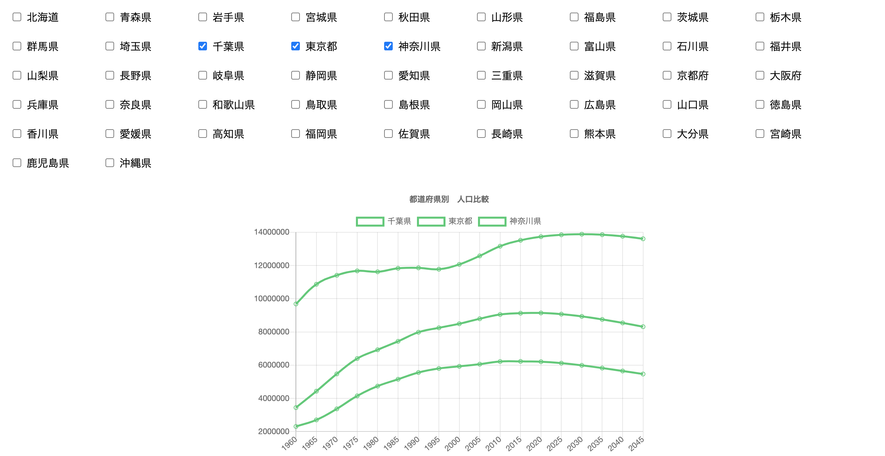

### demo
https://vue-population-graph.web.app/

## Vue + Chart.jsでAPIデータをグラフ描画する

* 使用API (RESAS)：https://opendata.resas-portal.go.jp/
* RESAS API仕様書：https://opendata.resas-portal.go.jp/docs/api/v1/index.html

-------------------------------------------------------------
 

|仕様の条件|達成|
|---|---|
|RESAS(地域経済分析システム) APIの「都道府県一覧」からAPIを取得する|○|
|APIレスポンスから都道府県一覧のチェックボックスを動的に生成する|○|
|都道府県にチェックを入れると、RESAS APIから選択された都道府県の 「人口構成」を取得する|○|
|人口構成APIレスポンスから、X軸:年、Y軸:人口数の折れ線グラフを動的に 生成して表示する|○|

